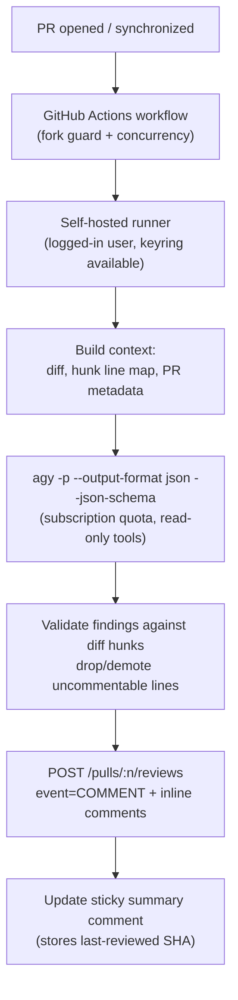

# Plan: `pr-auto-review` — a self-hosted PR reviewer powered by Antigravity

A publishable GitHub Action that reviews pull requests using the Antigravity CLI (`agy`) on a
self-hosted runner, posting inline review comments through the GitHub API. Effectively a
self-hosted CodeRabbit / Bugbot replacement funded by an already-paid Google AI Pro subscription.

---

## 1. Feasibility: yes, and here is the constraint that shapes everything

The architecture in the reference diagram is sound, and the reason it insists on a **self-hosted
runner** is the single most important fact in this document:

- `agy` reaches the **Google AI Pro subscription quota** only through credentials cached in the
  **OS keyring** (Windows Credential Manager / Apple Keychain / libsecret), written by a one-time
  interactive `agy` login on that machine.
- Setting `GEMINI_API_KEY` switches `agy` into a **separate pay-per-token billing mode**. Per
  Antigravity's plans page, there is *no* bring-your-own-key path to extend subscription limits.

So an API key on a GitHub-hosted runner would work technically but **bills you again** and leaves
the Antigravity quota untouched — defeating the entire purpose. The review must execute on a
machine you have logged into. That is exactly why the runner is self-hosted.

Everything else needed is confirmed to exist:

- `agy -p "<prompt>"` runs headless, one prompt, then exits.
- `--output-format json` returns `{conversation_id, status, response, error, usage, ...}`.
- `--json-schema` constrains the answer and returns it parsed under `structured_output` — this is
  what turns a chat reply into machine-readable findings.
- `--model`, `--effort`, `--print-timeout` (default `5m`), `--sandbox`.
- Reading files inside the workspace is auto-allowed; shell commands default to soft-denied in
  headless mode, which is the safe posture we want.

### Flow



---

## 2. Deliverable shape

A **Node 24 JavaScript GitHub Action** (`runs.using: node24`), TypeScript source bundled to
`dist/index.js` with `@vercel/ncc` so consumers need no install step. Chosen over a composite
action because it avoids bash-vs-pwsh divergence across self-hosted runner OSes, and over a Docker
action because the container could not reach the host keyring.

Consumers add one workflow file. The Action does the rest.

```yaml
# .github/workflows/ai-review.yml in a consumer repo
name: AI PR Review
on:
  pull_request:
    types: [opened, synchronize, reopened, ready_for_review]

permissions:
  contents: read
  pull-requests: write

concurrency:
  group: ai-review-${{ github.event.pull_request.number }}
  cancel-in-progress: true

jobs:
  review:
    # Never let fork PRs execute on a self-hosted runner.
    if: github.event.pull_request.head.repo.full_name == github.repository
    runs-on: [self-hosted, antigravity]
    steps:
      - uses: actions/checkout@v6
        with:
          fetch-depth: 0
      - uses: <you>/pr-auto-review@v1
        with:
          github-token: ${{ secrets.GITHUB_TOKEN }}
          model: gemini-3.1-pro-high
          effort: high
```

### Repository layout

```
action.yml                     # node24 JS action metadata
package.json / tsconfig.json
src/
  main.ts                      # orchestration + failure handling
  config.ts                    # merge action inputs with .pr-review.yml
  github/
    client.ts                  # Octokit via @actions/github
    diff.ts                    # fetch diff, parse hunks, build commentable-line map
    review.ts                  # submit review, sticky summary, dedupe
  agy/
    detect.ts                  # locate + version-check agy, preflight auth
    run.ts                     # spawn agy, parse envelope, retry/timeout
    prompt.ts                  # build the review prompt
    schema.ts                  # findings JSON schema
  findings.ts                  # validate, filter, rank, render
.github/workflows/
  ci.yml                       # build, lint, test, verify dist/ is current
  self-review.yml              # dogfood this Action on its own PRs
examples/ai-review.yml
docs/self-hosted-runner-setup.md
README.md
```

---

## 3. Core mechanics

### 3.1 Building the diff context

Fetch the PR diff via the API (`GET /pulls/{n}/files`, paginated) rather than shelling out to
`git`, so behavior is identical on every runner OS.

Two things get built from it:

1. **The prompt payload** — a unified diff with explicit line numbers annotated per added/context
   line, so the model can cite an exact `path` + `line` + `side` instead of guessing.
2. **A commentable-line map** — the set of `(path, line, side)` tuples that GitHub will actually
   accept an inline comment on. This is load-bearing; see 3.4.

The agent also runs with the PR checked out as its working directory, so it can read surrounding
files for context beyond the diff. That is the main quality edge over diff-only review, and it is
free: in-workspace file reads are auto-allowed in headless mode.

### 3.2 Invoking `agy`

```
agy -p <prompt>
    --output-format json
    --json-schema <path to schema.json>
    --model gemini-3.1-pro-high
    --effort high
    --print-timeout 15m
```

Run with `cwd` set to the checkout. Deliberately **no `--dangerously-skip-permissions`** — review
is a read-only task, and PR branch contents are semi-trusted input. Leaving the default policy in
place means shell commands and writes are soft-denied. `--sandbox` is exposed as an opt-in input
for extra containment.

Treat the process as follows:
- Non-zero exit, or `status != "SUCCESS"` in the envelope: surface `error`, retry once, then fail
  the step with a clear message.
- Read findings from `structured_output`, not from `response` (which is the same payload as a
  string).
- Log `usage.total_tokens` into the step summary so quota burn per PR is visible.

### 3.3 The findings schema

```json
{
  "type": "object",
  "required": ["summary", "verdict", "findings"],
  "properties": {
    "summary": { "type": "string" },
    "verdict": { "type": "string", "enum": ["approve", "comment", "request_changes"] },
    "findings": {
      "type": "array",
      "items": {
        "type": "object",
        "required": ["path", "line", "side", "severity", "category", "title", "body", "confidence"],
        "properties": {
          "path":       { "type": "string" },
          "line":       { "type": "integer" },
          "side":       { "type": "string", "enum": ["LEFT", "RIGHT"] },
          "severity":   { "type": "string", "enum": ["critical", "high", "medium", "low"] },
          "category":   { "type": "string", "enum": ["bug", "security", "performance", "missing_test", "correctness", "api_misuse"] },
          "title":      { "type": "string" },
          "body":       { "type": "string" },
          "suggestion": { "type": "string" },
          "confidence": { "type": "number" }
        }
      }
    }
  }
}
```

When `suggestion` is present it is rendered as a GitHub ` ```suggestion ` block, giving one-click
apply in the review UI.

The prompt instructs: report only high-confidence defects; ignore formatting and style-only
issues; do not restate what the code does; cite an exact diff line. Empty findings is an
acceptable and expected outcome on clean PRs.

### 3.4 Posting the review (the part that usually breaks)

`POST /repos/{owner}/{repo}/pulls/{n}/reviews` with `event: "COMMENT"`, a `body` summary, and a
`comments[]` array. Deliberately not `APPROVE`/`REQUEST_CHANGES`: `GITHUB_TOKEN` reviews are
restricted and a bot blocking your own merges gets annoying fast. The verdict is reported as text
in the summary instead.

**The failure mode to design against:** if any single inline comment targets a line outside the
diff, GitHub rejects the *entire* review with a 422 and you get nothing. So before submitting:

- Drop findings whose `path` is not in the changed-file set.
- Check `(path, line, side)` against the commentable-line map; snap to the nearest line in the
  same hunk if close, otherwise demote the finding into the summary body rather than discarding it.
- Filter by `confidence` and `severity` thresholds, cap total inline comments (default 20, ranked
  by severity then confidence) so a noisy run cannot bury the PR.

**Sticky summary and incremental review.** Maintain one summary comment per PR, found by a hidden
marker `<!-- pr-auto-review:state {"lastSha":"..."} -->`. On `synchronize`, read `lastSha` from it
and review only the range since then, which keeps repeat pushes cheap in both tokens and noise.
No external database needed — the PR itself is the state store.

---

## 4. Quota and cost guards

Since the motivation is spending idle quota rather than creating a new bill, these are treated as
features, not afterthoughts:

- Pro quota refreshes every ~5 hours against a weekly cap; large-context PR review is expensive.
- Set the account's **AI Credit Overages** setting to `Never`, so exhausting the baseline quota
  pauses reviews instead of silently spending credits.
- Config knobs: `max-files`, `max-diff-bytes`, `min-changed-lines` (skip trivial PRs), and
  `exclude` globs defaulting to lockfiles, generated code, `dist/`, snapshots, vendored trees.
- Model tiering: a flash model for small PRs, `gemini-3.1-pro-high` above a size/label threshold.
- `skip-labels` (e.g. `skip-review`, `dependencies`) and draft-PR skipping.
- If quota is exhausted, post a short note on the PR and exit **neutral**, never red — a
  quota-blocked review must not look like a broken build.

---

## 5. Runner setup (the operational gotcha)

Documented in `docs/self-hosted-runner-setup.md`, because this is where the build will actually
trip:

- **The runner must run as the same OS user that ran the interactive `agy` login**, with that
  user's profile loaded. A runner installed as a service under `NT AUTHORITY\SYSTEM` cannot read
  your Windows Credential Manager entry and `agy` will exit with `authentication required`.
  - Simplest: run the runner interactively (`run.cmd`) in a logged-in session.
  - As a service: configure with `--windowslogonaccount` / `--windowslogonpassword` (or set the
    Log On account in `services.msc`), and note that a runner self-update can drop the loaded
    profile and require a restart.
  - On Linux, `libsecret`/gnome-keyring likewise needs an unlocked session keyring; a bare
    headless box needs `dbus-run-session` plus an unlocked keyring, so a desktop session or your
    own workstation is the path of least resistance.
- Runners need a label (e.g. `antigravity`) so workflows can target the authenticated machine.
- **Security:** never attach a self-hosted runner to a public repo without guards. A fork PR would
  otherwise execute attacker-controlled code on your machine with your keyring. The example
  workflow includes the same-repo `if` guard, and the docs will tell consumers to enable
  "Require approval for all outside collaborators" and prefer private repos.
- Preflight check in the Action itself: verify `agy` is on `PATH` and authenticated, and fail with
  an actionable message pointing at the setup doc rather than a raw CLI error.

---

## 6. Build order

Stage 0 is a genuine spike — it verifies the assumptions above before any code is written on top
of them.

1. **Spike: prove the CLI contract locally.** Install `agy` (not currently on this machine), log in
   interactively, and confirm from a script that `agy -p "..." --output-format json --json-schema ...`
   returns a populated `structured_output`. Specifically confirm stdout is not dropped when piped
   or redirected on Windows — early `agy` releases had this bug, and if it reproduces, the runner
   step needs a pseudo-TTY wrapper. Record the working invocation, and check `agy models` for the
   exact current model slugs.
2. **Scaffold.** Repo init, `.gitignore` (must include `agent-tools/`, which my research fetches
   created here), TypeScript + ncc build, `action.yml`, CI that fails if `dist/` is stale.
3. **GitHub layer.** Octokit client, paginated file/diff fetch, hunk parser, commentable-line map,
   plus unit tests over recorded diff fixtures — this is the highest-risk logic, so it gets tests
   first.
4. **Antigravity layer.** Process spawn, schema, prompt builder, envelope parsing, timeout/retry,
   auth preflight.
5. **Review submission.** Finding validation and demotion, suggestion blocks, ranking and caps,
   sticky summary with `lastSha`, incremental review on `synchronize`.
6. **Config and guards.** `.pr-review.yml` + action inputs, exclude globs, size caps, model
   tiering, skip labels, neutral exit on quota exhaustion.
7. **Dogfood.** `self-review.yml` reviewing this repo's own PRs on the self-hosted runner. Tune
   the prompt against real output until signal-to-noise is acceptable.
8. **Publish.** README with setup and security warnings, runner setup doc, `v1` tag with a moving
   major-version ref, optional Marketplace listing.

## 7. Open questions, deferred

Called out now so they are decisions rather than surprises later:

- Whether to also expose the optional `gemini-api-key` input as a fallback for consumers without
  an Antigravity subscription (better for publishability, but metered billing — would be clearly
  labeled as such).
- Whether to support a review-on-demand trigger via `/review` comment (`issue_comment` event) in
  addition to automatic runs.
